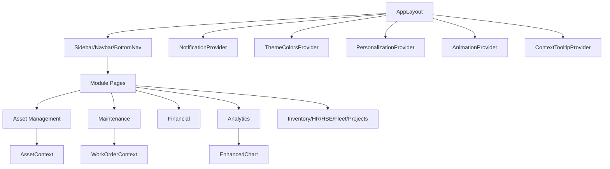

# Insight Hub (EAMS) – Deep-Dive Feature & Architecture Report

---

## Table of Contents
- [Project Overview](#project-overview)
- [Technology Stack](#technology-stack)
- [System Architecture](#system-architecture)
- [UI/UX Design System](#uiux-design-system)
- [Data Flow & State Management](#data-flow--state-management)
- [Core Modules & Features](#core-modules--features)
  - [Asset Management](#asset-management)
    - [Asset Management – Deep-Dive Feature & Analytics Report](#asset-management--deep-dive-feature--analytics-report)
    - [Asset Forms, Depreciation & Performance – Deep-Dive Reference](#asset-forms-depreciation--performance--deep-dive-reference)
  - [Maintenance Management](#maintenance-management)
    - [Maintenance Management – Deep-Dive Feature & Analytics Report](#maintenance-management--deep-dive-feature--analytics-report)
    - [Condition Monitoring – Deep-Dive Feature & Analytics Report](#condition-monitoring--deep-dive-feature--analytics-report)
  - [Financial Management](#financial-management)
  - [Other Modules](#other-modules)
- [Analytics, Visualization & ML](#analytics-visualization--ml)
- [Extensibility & Customization](#extensibility--customization)
- [Security, Accessibility & Compliance](#security-accessibility--compliance)
- [Testing & Quality Assurance](#testing--quality-assurance)
- [Summary Table of Features](#summary-table-of-features)
- [Conclusion](#conclusion)

---

## Project Overview

** Insight Hub** is a next-generation Enterprise Asset Management System (EAMS) designed for large-scale, data-driven organizations. It unifies asset, maintenance, financial, HR, inventory, and analytics workflows into a single, extensible platform. The system is built for real-time operations, deep analytics, and intelligent automation, with a strong focus on user experience, accessibility, and modularity.

---

## Technology Stack

- **Frontend:** React.js (TypeScript), Vite, Tailwind CSS
- **UI Library:** shadcn/ui (customized), Lucide icons
- **Charting:** Chart.js (via EnhancedChart), previously Recharts
- **State Management:** React Context, custom hooks
- **Testing:** Vitest, React Testing Library
- **Build Tools:** Vite, ESLint, PostCSS, Tailwind
- **Data Layer:** Mock/sample data in `src/data/`, context-driven state
- **AI/ML:** Predictive analytics, AI work order creation (see `src/components/maintenance/AIWorkOrderCreator.tsx`)

---

## System Architecture

### **Directory Structure**
- `src/components/`: Modular, reusable UI and business logic components
- `src/pages/`: Route-based page components for each business domain
- `src/data/`: Mock/sample data for development and analytics
- `src/contexts/`: Context providers for global state (e.g., AssetContext)
- `src/hooks/`: Custom hooks for theme, mobile, keyboard shortcuts, etc.
- `src/types/`: TypeScript type definitions for all business entities
- `src/utils/`: Utility functions for chart config, color, local storage, etc.

### **Architecture Diagram**


---

## UI/UX Design System

### Layout & Navigation
- **AppLayout** (`src/components/layout/AppLayout.tsx`): Responsive sidebar, navbar, bottom nav, floating action button
- **Navigation**: Sidebar (desktop), bottom nav (mobile), quick actions, keyboard shortcuts

### Theming & Personalization
- **Theme Switcher** (`src/components/ui/theme-switcher.tsx`): Light/dark/system, 7-color Financial Hub palette, real-time updates
- **Glass Morphism**: Glass card styling, backdrop blur, modern effects
- **Accessibility**: WCAG AA color contrast, keyboard navigation, ARIA labels

### UI Components
- **Reusable Components**: Buttons, cards, dialogs, tabs, accordions, tooltips, dropdowns, progress, badges, alerts, etc. (see `src/components/ui/`)
- **Notification System** (`notification-system.tsx`): Context-based, priority, auto-dismiss, persistent, action buttons, glass card notifications

### Data Entry & Feedback
- **Forms**: Rich validation, tooltips, contextual help, inline add equipment, ISO 10816 zone calculation
- **Feedback**: Toasts, notifications, inline validation, loading states, error handling

---

## Data Flow & State Management

- **Context Providers**: AssetContext, NotificationContext, ThemeColorsProvider, PersonalizationProvider
- **Custom Hooks**: `use-theme`, `use-theme-colors`, `use-mobile`, `use-toast`, `useKeyboardShortcuts`
- **Data Layer**:
  - **Hierarchical Asset Data** (`src/data/hierarchicalAssetData.ts`): 350+ real equipment items with complete specifications
  - **Real Equipment Categories**: Pumps (74), Motors (48), Valves (100+), Strainers (15+), Sensors (10+), Actuators (10+), Tanks (17), Compressors (32)
  - **Manufacturer Data**: HMS, SAER, ELDIN, ABB, ROBUSCHI/Italy, McWANE, TVN, AMA, El Haggar Misr, HC, EEC
  - **Hierarchical Structure**: Zone A → 13 Pump Stations (A01-A15) → Lines/Systems → Equipment
  - **Equipment Systems**: Main pumping lines, priming systems, water hammer systems, station equipment
  - Mock/sample data in `src/data/`, vibration history log, work order logs
- **Persistence**: Local storage utilities for work orders, settings
- **Real-Time Simulation**: Asset tracking and monitoring simulate real-time updates

---

## Hierarchical Asset Data Structure

### Real Equipment Integration (`src/data/hierarchicalAssetData.ts`)

The EAMS system now uses a comprehensive hierarchical asset data structure with 350+ real equipment items across Zone A's 13 pump stations (A01-A15).

#### **Equipment Categories & Counts:**
- **Main Pumps**: 48 units (HMS D200-500A-GGG, SAER M300-500A)
- **Priming Pumps**: 26 units (ROBUSCHI/Italy RVS7/M, RVS14/M, RVS16/M)
- **Motors**: 48 units (ELDIN А355SMA4FБT2, ABB M3BP series)
- **Valves**: 100+ units (McWANE, TVN, AOM/Proval, CSA, TECFLOW)
- **Strainers**: 15+ units (AMA stainless steel)
- **Sensors**: 10+ units (ABB Process Master 630, FEB632)
- **Actuators**: 10+ units (BERNARD AT6L electrical)
- **Water Hammer Tanks**: 17 units (HC, EEC brands, 14-48 m³)
- **Compressors**: 32 units (El Haggar Misr HGF 500/580, HAC 300/380)

#### **Hierarchical Structure:**
```
Zone A
├── Pump Station A01 (4 lines + systems)
│   ├── Line P1 (Pump + Motor + Valves/Strainers)
│   ├── Line P2 (Pump + Motor + Valves/Strainers)
│   ├── Line P3 (Pump + Motor + Valves/Strainers)
│   ├── Line P4 (Pump + Motor + Valves/Strainers)
│   ├── Priming System (2 ROBUSCHI pumps)
│   ├── Water Hammer System (2 tanks + 3 compressors)
│   └── Station Equipment (Main header, water hammer connections, main drain)
├── Pump Station A02...A15 (similar structure)
```

#### **Real Manufacturer Data:**
- **Pump Manufacturers**: HMS (Italy), SAER (Italy), ROBUSCHI/Italy
- **Motor Manufacturers**: ELDIN (Egypt), ABB (Switzerland)
- **Valve Manufacturers**: McWANE (USA), TVN (Turkey), AOM/Proval, CSA, TECFLOW
- **Equipment Suppliers**: AMA (strainers), BERNARD (actuators), Helio Power (vendor)
- **Tank/Compressor**: HC, EEC (tanks), El Haggar Misr (Egyptian compressors)

#### **Data Integration Benefits:**
- **Realistic Asset Values**: $10M+ total asset value vs. previous sample data
- **Proper Equipment Specifications**: Real flow rates, pressures, capacities, serial numbers
- **Manufacturer-Specific Valuations**: Premium brands command appropriate pricing
- **Lifecycle Management**: Age-appropriate depreciation and maintenance schedules
- **Performance Analytics**: Equipment-specific KPIs based on actual specifications

---

## Core Modules & Features

### Asset Management
- **Enhanced Asset Registry** (`src/pages/assets/EnhancedAssetRegistry.tsx`)
    - **Data Integration**: Uses `allHierarchicalEquipment` from `src/data/hierarchicalAssetData.ts` (350+ real equipment items)
    - **View Modes**: Table, card, and **NEW** tree view with hierarchical navigation
    - **Real Equipment Data**: 48 main pumps, 26 priming pumps, 48 motors, 100+ valves/strainers, 17 tanks, 32 compressors
    - **Hierarchical Structure**: Zone A → Pump Station → Line/System → Equipment
    - **Real Manufacturers**: HMS, SAER, ELDIN, ABB, ROBUSCHI/Italy, McWANE, TVN, AMA, El Haggar Misr, HC, EEC
    - **Tree View Features**: Expandable/collapsible nodes, equipment count badges, category-specific icons, theme-aware styling
    - **Enhanced Location Display**: Full hierarchical paths with zone, station, line/system context
    - Table & card views, fuzzy search, multi-criteria filtering
    - KPIs: total, operational, critical alerts, avg. condition with real equipment category breakdown
    - Asset type distribution analytics with 8 equipment categories
    - Add/edit/view/delete with modals (`EnhancedAssetFormModal`, `EnhancedAssetDetailsModal`)
    - Floating filter panel (`FloatingFilterPanel`)
    - Real-time updates, export/import functionality

- **Asset Tracking Module** (`src/pages/assets/AssetTracking.tsx`)
    - **Data Integration**: Updated to use `allHierarchicalEquipment` (350+ real equipment items)
    - **Enhanced Location Tracking**: Hierarchical paths showing Zone → Station → Line/System → Building → Room
    - **Real Equipment Data**: All 8 equipment categories with real manufacturer data
    - **Equipment Category Breakdown**: Dedicated stat cards for pumps, motors, valves, strainers, sensors, actuators, tanks, compressors
    - **Enhanced Statistics**: Real equipment counts vs. previous 2 sample items
    - **Manufacturer Integration**: HMS, SAER, ELDIN, ABB, ROBUSCHI/Italy, McWANE, TVN, AMA, El Haggar Misr, HC, EEC
    - **Interactive Features**: Real-time monitoring, QR code generation, check-in/out system, audit trail viewer
    - **Location Display**: Multi-level location hierarchy with proper asset tagging
    - **Tracking Capabilities**: Asset timeline viewer, facility map integration, floating filter panel

#### Asset Management – Deep-Dive Feature & Analytics Report

##### Overview
The Asset Management module is a comprehensive, multi-tabbed system for managing all industrial assets, supporting advanced search, filtering, analytics, and real-time monitoring. It is designed for asset managers, engineers, and maintenance teams to efficiently track, analyze, and optimize asset performance and lifecycle.

---

##### Tabs & Their Features

###### 1. Overview Tab
- **Purpose:** Centralized registry and summary of all assets.
- **Features:**
  - **KPI Cards:**
    - *Total Assets*: Count of all assets.
    - *Operational Rate*: % of assets operational.
    - *Critical Alerts*: Number of assets with critical alerts.
    - *Health Score*: Average condition rating.
  - **Asset Table/Card View:**
    - Toggle between table and card layouts.
    - Table: Equipment, type/category, location, status, condition, last maintenance, alerts, actions.
    - Card: Key details, quick actions (view, edit), status/condition badges.
  - **Search & Filtering:**
    - Fuzzy search across all asset fields.
    - Multi-criteria filtering (type, category, status, condition, location, manufacturer).
    - Floating filter panel for advanced filtering.
  - **Bulk Actions:**
    - Import/export, add asset, reset data, simulate real-time update.
  - **Modals:**
    - Add/edit asset modal, asset details modal.

###### 2. Mechanical Tab
- **Purpose:** Focused view and analytics for mechanical assets.
- **Features:**
  - **Card Grid:**
    - Each card: name, status, condition, power, vibration (RMS, ISO zone), quick actions.
  - **Vibration Monitoring:**
    - Inline display of vibration metrics and ISO 10816 zone.

###### 3. Electrical Tab
- **Purpose:** Focused view and analytics for electrical assets.
- **Features:**
  - **Card Grid:**
    - Each card: name, status, condition, voltage, current, temperature, quick actions.
  - **Thermal Monitoring:**
    - Inline display of max temperature and delta T.

###### 4. Instrumentation Tab
- **Purpose:** Focused view and analytics for instrumentation assets.
- **Features:**
  - **Card Grid:**
    - Each card: name, status, condition, key specs, quick actions.

###### 5. Monitoring Tab
- **Purpose:** Real-time condition monitoring for all assets.
- **Features:**
  - **Vibration Monitoring:**
    - List of assets with vibration data (RMS, ISO zone).
  - **Thermal Monitoring:**
    - List of assets with thermal data (max temp, delta T).

###### 6. Maintenance Tab
- **Purpose:** Maintenance scheduling and planning.
- **Features:**
  - **Maintenance Schedule List:**
    - Assets with upcoming maintenance, sorted by date.
    - Days until maintenance, overdue badges, quick schedule action.

###### 7. Analytics Tab
- **Purpose:** Asset performance analytics and KPIs.
- **Features:**
  - **KPI Cards:**
    - OEE, MTBF, MTTR, Availability.
  - **Active Alerts:**
    - List of current alerts, severity badges, equipment, and messages.

---

##### Chart & Analytics Details

###### Charts Used
- **KPI Cards:** Total assets, operational rate, critical alerts, health score, OEE, MTBF, MTTR, availability.
- **Bar/Badge Visuals:** For status, condition, ISO zone, delta T, overdue maintenance.
- **Table/Card Views:** For asset registry and quick actions.

###### Data Sources & Calculations
- **Assets:**
  - Sourced from context and enhanced asset data.
- **KPIs:**
  - Calculated in real-time from filtered asset list.
- **Analytics:**
  - OEE, MTBF, MTTR, availability, health score, alert counts.
- **Maintenance:**
  - Days until next maintenance, overdue status.
- **Condition Monitoring:**
  - Inline vibration and thermal metrics, ISO zone, delta T.

---

##### Functions & Interactivity

- **Tab Navigation:**
  - Main tabs for asset type, monitoring, maintenance, analytics.
- **Search & Filtering:**
  - Fuzzy search, multi-criteria filtering, floating filter panel.
- **View Modes:**
  - Toggle between table and card views.
- **Asset Lifecycle:**
  - Add, edit, view, delete assets via modals.
- **Bulk Actions:**
  - Import/export, reset, simulate update.
- **Condition Monitoring:**
  - Inline display of vibration, thermal, and alert data.
- **Maintenance Scheduling:**
  - List, sort, and badge for upcoming/overdue maintenance.
- **Analytics:**
  - Real-time KPIs, alert lists, performance metrics.

---

##### UI/UX Patterns

- **Tabs:**
  - Main tabs for asset type, monitoring, maintenance, analytics.
- **Cards & Badges:**
  - Consistent use for status, condition, ISO zone, delta T, alerts.
- **Glass Morphism:**
  - Modern, glassy backgrounds for all cards and widgets.
- **Floating Panels:**
  - Filter panel, modals for add/edit/details.
- **Responsive Design:**
  - All features mobile-friendly.
- **Quick Actions:**
  - Prominent buttons for add, import/export, reset, update.

---

##### Extensibility

- **Component-Based:**
  - Each tab and analytic is a separate component.
- **Chart.js Integration:**
  - All analytics use EnhancedChart, supporting new chart types and data sources.
- **API-Driven:**
  - Placeholders for backend integration (import/export, real-time updates).

---

##### Summary Table

| Tab             | Main Features                                                                 | Charts/Analytics                | Key Components                |
|-----------------|-------------------------------------------------------------------------------|----------------------------------|-------------------------------|
| Overview        | Registry, search/filter, table/card, KPIs, modals, bulk actions               | KPI cards, badges, table/card    | Table, Card, StatCard, Badge, EnhancedAssetFormModal, EnhancedAssetDetailsModal |
| Mechanical      | Mechanical assets, vibration, power, quick actions                            | KPI cards, badges                | Card, Badge                   |
| Electrical      | Electrical assets, voltage/current/temp, quick actions                        | KPI cards, badges                | Card, Badge                   |
| Instrumentation | Instrumentation assets, key specs, quick actions                              | KPI cards, badges                | Card, Badge                   |
| Monitoring      | Vibration/thermal monitoring, real-time data                                  | KPI cards, badges                | Card, Badge                   |
| Maintenance     | Maintenance schedule, overdue, quick schedule                                 | KPI cards, badges                | Card, Badge                   |
| Analytics       | OEE, MTBF, MTTR, availability, active alerts                                  | KPI cards, badges                | Card, Badge                   |

---

##### Conclusion
The Asset Management module is a robust, analytics-driven, and highly interactive system for managing the full lifecycle of industrial assets. It supports advanced search, filtering, analytics, and real-time monitoring, with a modern, extensible, and user-friendly UI/UX. All analytics and logs are real-time and exportable, and the system is ready for further integration and scaling.

##### Asset Forms, Depreciation & Performance – Deep-Dive Reference

This section provides a direct reference to the core forms and analytics features within Asset Management, including their file locations, structure, and key functionalities:

---

**1. Add Asset Form**
- **Component:** `EnhancedAssetFormModal.tsx` (`src/components/assets/EnhancedAssetFormModal.tsx`)
- **Purpose:** Used for adding or editing assets.
- **Features:**
  - Multi-step form (General Info, Specifications, Location, etc.)
  - Validates required fields (name, type, category, manufacturer, model, serial number, location, etc.)
  - Handles nested fields (location, specifications)
  - Supports both creation and editing (edit mode pre-fills data)
  - UI: Dialog/modal, cards, input fields, select dropdowns, step navigation
- **UX:** Modern, guided, error-highlighted, and mobile-friendly.

**2. Asset Details Form**
- **Component:** `EnhancedAssetDetailsModal.tsx` (`src/components/assets/EnhancedAssetDetailsModal.tsx`)
- **Purpose:** Shows detailed information about a selected asset.
- **Features:**
  - Multi-tabbed modal: Overview, Monitoring, Maintenance, Specifications, History, Documents
  - Displays health score, operating hours, active alerts, and asset status/condition
  - Shows trend charts (vibration, temperature, etc.) and maintenance history
  - Edit button to open the asset form modal in edit mode
  - UI: Rich cards, badges, progress bars, tabs, and icons for asset type/status
- **UX:** Highly visual, quick navigation between tabs, contextual actions.

**3. Asset Depreciation**
- **Page:** `AssetDepreciation.tsx` (`src/pages/assets/AssetDepreciation.tsx`)
- **Purpose:** Manages and analyzes asset depreciation for financial and compliance reporting using real equipment data.
- **Data Integration:** Updated to use `allHierarchicalEquipment` with realistic asset valuations
- **Enhanced Features:**
  - **Category-Specific Valuations:** Equipment values based on type and specifications (pumps: $15K-$35K, motors: $25K, tanks: $45K+)
  - **Manufacturer Value Adjustments:** Premium multipliers (HMS: 1.2x, ABB: 1.3x, ROBUSCHI: 1.4x, etc.)
  - **Specification-Based Pricing:** Valve size, tank capacity, and equipment specifications affect valuations
  - **Real Useful Life Estimates:** Category-appropriate lifespans (pumps: 15 years, motors: 20 years, tanks: 30 years)
  - **Equipment Category Breakdown:** Depreciation overview showing value distribution across 8 categories
  - **Total Asset Value:** ~$10M+ across 350+ equipment items (vs. previous $25K sample)
  - **Lifecycle-Based Methods:** Appropriate depreciation methods by equipment type
  - Dashboard with stat cards (Original Value, Book Value, Tax Value, Total Depreciation, etc.)
  - Filtering by asset, depreciation method, and type
  - Depreciation charts (book value, tax value, market value over time)
  - Depreciation schedule table (annual, quarterly, monthly views)
  - Export, calculation, and settings actions
  - UI: Tabs, tables, charts, cards, and export buttons
- **Analytics:** Visualizes depreciation trends, variances, and compliance metrics for real industrial assets.

**4. Asset Performance**
- **Page:** `AssetPerformance.tsx` (`src/pages/assets/AssetPerformance.tsx`)
- **Purpose:** Provides advanced analytics and KPIs for asset performance using real hierarchical equipment data.
- **Data Integration:** Updated to use `allHierarchicalEquipment` (350+ real equipment items)
- **Enhanced Features:**
  - **Real KPI Calculations:** Uses `calculateEquipmentKPIs()` with equipment-specific performance metrics
  - **Equipment Category Performance:** Breakdown by all 8 categories (pumps, motors, valves, strainers, sensors, actuators, tanks, compressors)
  - **Zone-Level Analytics:** Uses `calculateZoneKPIs(zoneA)` for hierarchical performance roll-ups
  - **Station-Based Analysis:** Maintenance cost trends from real pump station data
  - **Manufacturer Performance:** Comparison across HMS, SAER, ELDIN, ABB, ROBUSCHI, etc.
  - **Lifecycle Stage Determination:** Based on installation date and equipment condition
  - **Error-Safe Display:** Comprehensive null checks and default values for all metrics
  - Dashboard with stat cards (OEE, Availability, MTBF, Maintenance Cost, Health Score, etc.)
  - Equipment category performance cards showing real counts and availability percentages
  - Filtering by asset, status, and condition
  - KPI gauge charts, time series charts, ROI analysis
  - Performance tables with 350+ equipment items and trend analytics
  - AI Insights and export options
  - UI: Tabs, charts, cards, tables, and action buttons
- **Analytics:** Tracks and visualizes key performance metrics, trends, and ROI for real industrial equipment.

---

**In summary:**
- **Add/Edit Asset:** `EnhancedAssetFormModal.tsx`
- **Asset Details:** `EnhancedAssetDetailsModal.tsx`
- **Depreciation:** `AssetDepreciation.tsx` (with `DepreciationChart.tsx` and `DepreciationScheduleTable.tsx`)
- **Performance:** `AssetPerformance.tsx` (with KPI and analytics charts)

This reference ensures you can quickly locate and understand the structure and features of all core asset management forms and analytics in the codebase.

### Maintenance Management
- **Work Order Management** (`src/pages/maintenance/WorkOrders.tsx`, `EnhancedWorkManagement.tsx`)
    - Full CRUD, advanced filtering, KPIs, bulk actions, keyboard shortcuts
    - AI-powered work order creator (`AIWorkOrderCreator`), insights panel (`AIInsightsPanel`)
    - Automated generator, analytics, reports, mobile view
    - Data: `src/data/testWorkOrders.ts`
- **Condition Monitoring** (`src/pages/maintenance/ConditionMonitoring.tsx`)
    - ISO 10816-compliant, real-time KPIs, vibration data entry (`VibrationDataEntryForm.tsx`)
    - Historical log (`src/data/vibrationHistoryData.ts`), Weibull analysis, RCFA
    - Floating vibration history widget, advanced predictive analytics
- **Predictive Maintenance** (`src/pages/maintenance/PredictiveMaintenance.tsx`)
    - AI-powered failure prediction, risk scoring, cost savings, confidence
    - Search/filter, severity badges, details

#### Maintenance Management – Deep-Dive Feature & Analytics Report

##### Overview
The Maintenance Management module is a comprehensive, multi-tabbed system for handling all aspects of maintenance work orders, analytics, scheduling, and AI-powered insights. It is designed for both desktop and mobile users, with advanced filtering, real-time KPIs, and deep analytics.

---

##### Tabs & Their Features

###### 1. Dashboard Tab
- **Purpose:** Executive summary and quick overview of maintenance operations.
- **Features:**
  - **KPI Cards:**
    - *Total Work Orders*: Count of all work orders in the system.
    - *In Progress*: Number of work orders currently being executed.
    - *Critical/High Priority*: Count of urgent work orders.
    - *On-Time Completion*: Percentage of work orders completed on or before due date.
  - **Recent Work Orders:**
    - List of the latest work orders with title, equipment, assigned user, priority, and status badges.
  - **Performance Metrics:**
    - *Avg Completion Time*: Average hours to complete a work order.
    - *Technician Utilization*: Percentage of technician time spent on work.
    - *Cost Variance*: Percentage over/under budget.
    - *Work Orders This Month*: Count for the current month.
  - **Quick Actions:**
    - Buttons for AI Scheduler, Team Status, Optimize Schedule, Generate Report.

###### 2. Work Orders Tab
- **Purpose:** Full management of all work orders.
- **Features:**
  - **Search & Filtering:**
    - Search by title, description, or equipment.
    - Filter by status (open, assigned, in-progress, completed) and priority (critical, high, medium, low).
  - **Work Order List:**
    - For each order: title, description, assigned user, location, due date, priority/status badges, estimated/actual hours, cost.
    - Actions: Start Work, Edit, View Details.
  - **Work Order Creation/Editing:**
    - Modal form for creating or editing work orders, including all fields (title, description, equipment, priority, status, dates, cost, procedures).

###### 3. Mobile View Tab
- **Purpose:** Optimized interface for field technicians.
- **Features:**
  - **MobileWorkOrderCard:**
    - Compact cards for each work order, with quick actions:
      - Start Work, Complete Work, Take Photo, Record Voice, Navigate to Location.
    - Designed for touch and offline/AR guidance.

###### 4. AI Insights Tab
- **Purpose:** AI-powered recommendations and insights.
- **Features:**
  - **AIInsightsPanel:**
    - (Implementation in `AIInsightsPanel.tsx`)
    - Provides predictive analytics, anomaly detection, and suggested actions based on historical and real-time data.
    - May include charts, risk scores, and recommended scheduling.

###### 5. Analytics Tab
- **Purpose:** Deep analytics and visualizations for maintenance performance.
- **Features:**
  - **KPI Cards:**
    - *Completion Rate*: % of completed work orders.
    - *Avg Completion Time*: Average hours per order.
    - *Overdue Orders*: Count of overdue work orders.
    - *Avg Cost per Order*: Mean cost.
  - **Charts (via EnhancedChart):**
    - **Work Orders by Priority (Pie Chart):**
      - Distribution of work orders by priority (critical, high, medium, low).
    - **Status Distribution (Bar Chart):**
      - Number of work orders by status (open, assigned, in-progress, completed).
    - **Monthly Work Order Trends (Area Chart):**
      - Created vs. completed work orders over the last 6 months.
  - **Detailed Analytics:**
    - **Top Performers:**
      - List of technicians with order counts and performance percentages.
    - **Most Serviced Equipment:**
      - Equipment with the highest number of work orders.
    - **Upcoming Deadlines:**
      - List of work orders due soon or overdue, with badges.

###### 6. Reports Tab
- **Purpose:** Generate and view detailed maintenance reports.
- **Features:**
  - **WorkOrderReports:**
    - (Implementation in `WorkOrderReports.tsx`)
    - Generates tabular and graphical reports for export or review.
    - May include cost breakdowns, completion rates, and compliance metrics.

###### 7. Scheduling Tab
- **Purpose:** Overview and optimization of maintenance scheduling.
- **Features:**
  - **Schedule Overview:**
    - *Work Order Completion Rate*: % completed on time.
    - *Average Response Time*: Time from creation to start.
    - *Technician Efficiency*: Utilization rate.
    - *Equipment Uptime*: % of time equipment is operational.
  - **Cost Analysis:**
    - *Total Labor Cost*, *Parts & Materials*, *External Services*, *Total Monthly Cost*.

---

##### Chart & Analytics Details

###### Charts Used
- **Pie Chart:**
  - *Work Orders by Priority* (Critical, High, Medium, Low)
- **Bar Chart:**
  - *Status Distribution* (Open, Assigned, In Progress, Completed)
- **Area Chart:**
  - *Monthly Work Order Trends* (Created vs. Completed)
- **KPI Cards:**
  - Completion Rate, Avg Completion Time, Overdue Orders, Avg Cost per Order

###### Data Sources & Calculations
- **Work Orders:**
  - Sourced from state/context, with each order containing fields for status, priority, assigned user, equipment, cost, dates, and procedures.
- **KPIs:**
  - Calculated in real-time from the current work order list.
- **Analytics:**
  - Priority and status distributions are dynamically calculated for charts.
  - Monthly trends use generated or real data for visualization.
  - Cost analysis sums and averages costs across all orders.

###### Advanced Analytics
- **Top Performers:**
  - Ranks technicians by number of completed orders and performance %.
- **Most Serviced Equipment:**
  - Ranks equipment by maintenance frequency.
- **Upcoming Deadlines:**
  - Highlights orders due soon or overdue, with color-coded badges.

---

##### Functions & Interactivity

- **Work Order Lifecycle:**
  - Create, edit, start, complete, and view work orders.
  - Actions are available contextually based on status.
- **Filtering & Search:**
  - Real-time filtering by status, priority, and search term.
- **Mobile Actions:**
  - Field techs can start/complete work, take photos, record voice notes, and navigate to locations.
- **AI/ML Integration:**
  - AI tab provides predictive insights and recommendations.
- **Export & Reporting:**
  - Analytics and reports can be exported for compliance and review.

---

##### UI/UX Patterns

- **Tabs:**
  - All features are organized into clear, accessible tabs for workflow separation.
- **Cards & Badges:**
  - Consistent use of cards for grouping, badges for status/priority.
- **Glass Morphism:**
  - Modern, glassy card backgrounds for visual clarity.
- **Responsive Design:**
  - All tabs and features are mobile-friendly.
- **Quick Actions:**
  - Prominent buttons for common tasks and AI-powered features.

---

##### Extensibility

- **Component-Based:**
  - Each tab and feature is a separate component, making it easy to extend or customize.
- **Chart.js Integration:**
  - All analytics use EnhancedChart, supporting new chart types and data sources.
- **AI/ML Ready:**
  - AI tab and analytics are designed for further ML integration.

---

##### Summary Table

| Tab         | Main Features                                                                 | Charts/Analytics                | Key Components                |
|-------------|-------------------------------------------------------------------------------|----------------------------------|-------------------------------|
| Dashboard   | KPIs, recent orders, metrics, quick actions                                   | KPI cards                        | StatCard, Card                |
| Work Orders | Search, filter, CRUD, status/priority badges, cost, time tracking             | -                                | WorkOrderFormModal, Card      |
| Mobile      | Mobile cards, quick actions, AR/offline support                               | -                                | MobileWorkOrderCard           |
| AI Insights | Predictive analytics, recommendations                                         | (varies, AI-driven)              | AIInsightsPanel               |
| Analytics   | KPIs, pie/bar/area charts, top performers, equipment, deadlines               | Pie, bar, area, KPI cards        | WorkOrderAnalytics, EnhancedChart |
| Reports     | Tabular/graphical reports, export                                             | (varies, report-driven)          | WorkOrderReports              |
| Scheduling  | Completion rate, response time, efficiency, uptime, cost analysis             | KPI cards, cost breakdown        | Card                          |

---

##### Conclusion
The Maintenance Management module is a robust, analytics-driven, and highly interactive system. It supports the full lifecycle of work orders, deep analytics, AI-powered insights, and advanced scheduling/cost analysis. The UI/UX is modern, accessible, and extensible, making it suitable for both field and management users. All analytics and charts are real-time and exportable, and the system is ready for further AI/ML and workflow automation enhancements.

### Condition Monitoring
- **Overview Tab**
  - **Purpose:** Fleet-wide summary of equipment health and monitoring status.
  - **Features:**
    - **Equipment Cards:**
      - Name, manufacturer, model, and condition badge.
      - **Vibration Monitoring:** ISO 10816 zone, RMS/peak velocity.
      - **Thermal Monitoring:** Max temperature, delta T.
      - **Oil Analysis:** Condition, viscosity.
      - **Alerts:** Active alerts with severity badges.
      - **Actions:** View details, calendar.
- **Vibration Tab**
  - **Purpose:** In-depth vibration analytics, data entry, and historical log.
  - **Features:**
    - **Dropdown:** Switch between 'Statistic Analysis' and 'Vibration Reading Form'.
    - **Statistic Analysis:**
      - **RMS Velocity Trend Chart:** Line chart for pump & motor.
      - **Advanced Vibration Analysis:**
        - ISO 10816, ISO 20816, API 610, and other standards.
        - FFT, envelope, phase analysis.
      - **Weibull & Statistical Analysis:**
        - Weibull parameters, MTTF, reliability at time, MTBF, MTTR, OEE, availability.
        - Trend analysis (SPC, moving averages, anomaly detection).
      - **Custom Alert Rules:** Placeholder for user-defined, API-driven alert rules.
    - **Vibration Reading Form:**
      - Data entry for new vibration readings (all fields, positions, etc.).
      - Integrated with vibration history log.
    - **Vibration History Log:**
      - Floating widget/table with all historical records (date, equipment, pump/motor RMS, zone, station, etc.).
      - Calculated RMS for each record.
      - Actions: View (future: edit/delete).
    - **Existing Vibration Data:**
      - For each monitored equipment: RMS, peak, displacement, last measured, frequency spectrum (mini-bar chart).
- **Thermal Tab**
  - **Purpose:** Infrared thermography and temperature monitoring.
  - **Features:**
    - **Equipment Cards:**
      - Max/avg/baseline temperature, delta T, hot spots.
      - Last measurement date.
      - Delta T badge (destructive if >10°C).
- **Oil Analysis Tab**
  - **Purpose:** Lubricant condition and contamination monitoring.
  - **Features:**
    - **Equipment Cards:**
      - Condition badge, viscosity, moisture, acidity (TAN), metal content (ppm for each metal).
      - Analysis date.
- **Alerts Tab**
  - **Purpose:** Centralized view of all active condition monitoring alerts.
  - **Features:**
    - **Alert Cards:**
      - Equipment, message, type, threshold, actual, time, severity badge.
      - Acknowledge button for unacknowledged alerts.
    - **Empty State:**
      - If no alerts, display 'All equipment is operating within normal parameters.'
- **Predictive Tab**
  - **Purpose:** Advanced predictive analytics and ML-driven insights.
  - **Features:**
    - **AdvancedPredictiveAnalytics Component:**
      - Multi-tabbed analytics (overview, Weibull, predictive alerts, health scores, optimization, RCFA, advanced analytics, explainability, prescriptive, notifications, ML pipelines).
      - **Weibull Analysis:** Reliability, failure density, hazard rate, MTTF, B10/B50 life, probability plots.
      - **Predictive Alerts:** Real-time ML-driven alerts.
      - **Health Scores:** Equipment health assessment.
      - **Optimization:** Maintenance strategy optimization.
      - **RCFA & PFMEA:** Root cause and failure mode analysis.
      - **Advanced Analytics:** Statistical and ML-based analysis.
      - **Explainability:** ML model explanations.
      - **Prescriptive:** Recommendations for action.
      - **Notification Workflows:** Alert management.
      - **ML Pipelines:** Pipeline management and monitoring.

#### Condition Monitoring – Deep-Dive Feature & Analytics Report

##### Overview
The Condition Monitoring module provides real-time, standards-compliant monitoring and analytics for equipment health, integrating vibration, thermal, oil, and predictive analytics. It is designed for reliability engineers, maintenance teams, and managers to proactively detect, analyze, and respond to equipment issues.

---

##### Tabs & Their Features

###### 1. Overview Tab
- **Purpose:** Fleet-wide summary of equipment health and monitoring status.
- **Features:**
  - **Equipment Cards:**
    - Name, manufacturer, model, and condition badge.
    - **Vibration Monitoring:** ISO 10816 zone, RMS/peak velocity.
    - **Thermal Monitoring:** Max temperature, delta T.
    - **Oil Analysis:** Condition, viscosity.
    - **Alerts:** Active alerts with severity badges.
    - **Actions:** View details, calendar.

###### 2. Vibration Tab
- **Purpose:** In-depth vibration analytics, data entry, and historical log.
- **Features:**
  - **Dropdown:** Switch between 'Statistic Analysis' and 'Vibration Reading Form'.
  - **Statistic Analysis:**
    - **RMS Velocity Trend Chart:** Line chart for pump & motor.
    - **Advanced Vibration Analysis:**
      - ISO 10816, ISO 20816, API 610, and other standards.
      - FFT, envelope, phase analysis.
    - **Weibull & Statistical Analysis:**
      - Weibull parameters, MTTF, reliability at time, MTBF, MTTR, OEE, availability.
      - Trend analysis (SPC, moving averages, anomaly detection).
    - **Custom Alert Rules:** Placeholder for user-defined, API-driven alert rules.
  - **Vibration Reading Form:**
    - Data entry for new vibration readings (all fields, positions, etc.).
    - Integrated with vibration history log.
  - **Vibration History Log:**
    - Floating widget/table with all historical records (date, equipment, pump/motor RMS, zone, station, etc.).
    - Calculated RMS for each record.
    - Actions: View (future: edit/delete).
  - **Existing Vibration Data:**
    - For each monitored equipment: RMS, peak, displacement, last measured, frequency spectrum (mini-bar chart).

###### 3. Thermal Tab
- **Purpose:** Infrared thermography and temperature monitoring.
- **Features:**
  - **Equipment Cards:**
    - Max/avg/baseline temperature, delta T, hot spots.
    - Last measurement date.
    - Delta T badge (destructive if >10°C).

###### 4. Oil Analysis Tab
- **Purpose:** Lubricant condition and contamination monitoring.
- **Features:**
  - **Equipment Cards:**
    - Condition badge, viscosity, moisture, acidity (TAN), metal content (ppm for each metal).
    - Analysis date.

###### 5. Alerts Tab
- **Purpose:** Centralized view of all active condition monitoring alerts.
- **Features:**
  - **Alert Cards:**
    - Equipment, message, type, threshold, actual, time, severity badge.
    - Acknowledge button for unacknowledged alerts.
  - **Empty State:**
    - If no alerts, display 'All equipment is operating within normal parameters.'

###### 6. Predictive Tab
- **Purpose:** Advanced predictive analytics and ML-driven insights.
- **Features:**
  - **AdvancedPredictiveAnalytics Component:**
    - Multi-tabbed analytics (overview, Weibull, predictive alerts, health scores, optimization, RCFA, advanced analytics, explainability, prescriptive, notifications, ML pipelines).
    - **Weibull Analysis:** Reliability, failure density, hazard rate, MTTF, B10/B50 life, probability plots.
    - **Predictive Alerts:** Real-time ML-driven alerts.
    - **Health Scores:** Equipment health assessment.
    - **Optimization:** Maintenance strategy optimization.
    - **RCFA & PFMEA:** Root cause and failure mode analysis.
    - **Advanced Analytics:** Statistical and ML-based analysis.
    - **Explainability:** ML model explanations.
    - **Prescriptive:** Recommendations for action.
    - **Notification Workflows:** Alert management.
    - **ML Pipelines:** Pipeline management and monitoring.

---

##### Chart & Analytics Details

###### Charts Used
- **Line Chart:** RMS velocity trend (pump & motor).
- **Bar/Column Mini-Charts:** Frequency spectrum for vibration.
- **Weibull/Statistical Charts:** Reliability, failure density, hazard rate, probability plots (in predictive tab).
- **KPI Cards:** Monitored equipment, active/critical alerts, health score.

###### Data Sources & Calculations
- **Monitored Equipment:**
  - Derived from asset context and condition monitoring data.
- **KPIs:**
  - Total monitored, active/critical alerts, health score (weighted by condition).
- **Vibration History:**
  - All form submissions logged, RMS calculated for each record.
- **Analytics:**
  - Weibull, MTBF, MTTR, OEE, availability, trend analysis, anomaly detection.
- **Alerts:**
  - Severity, type, threshold, actual value, timestamp, acknowledged status.
- **Predictive Analytics:**
  - ML-driven predictions, health scores, optimization, RCFA, prescriptive actions.

---

##### Functions & Interactivity

- **Tab Navigation:**
  - Smart navigation with dropdowns for sub-tabs (e.g., vibration analysis/form).
- **Data Entry:**
  - Vibration form with all fields, positions, and validation.
- **History Log:**
  - Floating widget/table, real-time updates, calculated fields.
- **Filtering & Search:**
  - By equipment, date, zone, etc. (future: advanced filtering).
- **Alert Management:**
  - Acknowledge, view details, severity color coding.
- **Predictive/ML:**
  - Multi-tabbed analytics, equipment selection, real-time updates.
- **Export/Reporting:**
  - Export reports, sync data, configure settings.

---

##### UI/UX Patterns

- **Tabs & Sub-Tabs:**
  - Main tabs for each monitoring type, dropdowns for sub-tabs.
- **Cards & Badges:**
  - Consistent use for equipment, alerts, and analytics.
- **Glass Morphism:**
  - Modern, glassy backgrounds for all cards and widgets.
- **Floating Widgets:**
  - Vibration history log as a floating modal.
- **Responsive Design:**
  - All features mobile-friendly.
- **Quick Actions:**
  - Prominent buttons for sync, export, configure, view details.

---

##### Extensibility

- **Component-Based:**
  - Each tab and analytic is a separate component.
- **Chart.js Integration:**
  - All analytics use EnhancedChart, supporting new chart types and data sources.
- **ML/AI Ready:**
  - Predictive tab and analytics are designed for further ML integration.
- **API-Driven:**
  - Placeholders for backend integration (standards, alert rules, trend analysis).

---

##### Summary Table

| Tab         | Main Features                                                                 | Charts/Analytics                | Key Components                |
|-------------|-------------------------------------------------------------------------------|----------------------------------|-------------------------------|
| Overview    | Fleet summary, equipment cards, all monitoring types                          | KPI cards, badges                | Card, StatCard, Badge         |
| Vibration   | RMS trend, advanced analysis, Weibull, form, history log, standards           | Line, bar, Weibull, KPI cards    | EnhancedChart, Card, VibrationDataEntryForm |
| Thermal     | Infrared analysis, temp/delta T, hot spots                                    | KPI cards, badges                | Card, Badge                   |
| Oil         | Lubricant analysis, metal content, acidity, moisture                          | KPI cards, badges                | Card, Badge                   |
| Alerts      | All alerts, severity, acknowledge, details                                    | KPI cards, badges                | Card, Badge, Button           |
| Predictive  | ML analytics, Weibull, health, optimization, RCFA, prescriptive, pipelines    | Line, bar, Weibull, ML charts    | AdvancedPredictiveAnalytics    |

---

##### Conclusion
The Condition Monitoring module is a highly advanced, standards-compliant, and analytics-driven system for real-time equipment health monitoring. It supports deep analytics, ML-driven insights, and proactive alerting, with a modern, extensible, and user-friendly UI/UX. All analytics and logs are real-time and exportable, and the system is ready for further AI/ML and backend integration.

### Financial Management
- **Financial Reports** (`src/pages/analytics/FinancialReports.tsx`)
    - Area/bar/donut charts, ROI, depreciation, budgeting
    - Export/share, KPI cards, trend analysis
    - Data: `src/data/financialData.ts` (if present)

### Other Business Modules
- **Inventory** (`src/pages/inventory/`): Procurement, stock, suppliers, warehouses
- **HR** (`src/pages/hr/`): Employees, attendance, payroll, performance, training
- **HSE** (`src/pages/hse/`): Incidents, compliance, safety audits, training
- **Fleet** (`src/pages/fleet/`): Vehicles, drivers, fuel, maintenance
- **Projects** (`src/pages/projects/`): List, planning, resources, timeline

### Analytics & Dashboards
- **Business Intelligence Dashboards** (`src/pages/analytics/AnalyticsDashboards.tsx`)
    - Operational, financial, strategic, compliance dashboards
    - KPI cards, area/bar/donut charts, incident trends, cost variance
    - Dashboard controls, period selection, export
    - Custom/asset/financial reports

## Analytics, Visualization & ML

### Charting System
- **EnhancedChart** (`src/components/charts/EnhancedChart.tsx`): Chart.js, theme-aware, glass morphism, export (PNG, PDF, CSV), color schemes, presets, interactive tooltips/legends
- **Specialized Charts**: ROI, depreciation, KPI gauges, time series, advanced statistical charts
- **Analytics Dashboards**: KPI cards, area/bar/donut charts, incident trends, cost variance

### AI/ML Features
- **Predictive Maintenance**: Failure prediction, risk scoring, cost savings, confidence
- **AI Work Order Creation**: Automated work order suggestions, insights
- **Advanced Analytics**: Weibull analysis, RCFA, trend analysis

## Extensibility & Customization

- **Modular Architecture**: Add new modules/pages/components easily
- **Theme & Color Customization**: User-selectable themes/colors, real-time updates
- **Personalization**: User preferences for layout, theme, quick actions
- **Floating Widgets**: Quick access to logs, analytics, and history
- **Export & Sharing**: Export charts/reports, share dashboards

## Security, Accessibility & Compliance

- **Authentication/Authorization**: (Pluggable, not shown in code, but architecture supports it)
- **Audit Trails**: Asset and work order history, vibration logs
- **Accessibility**: WCAG AA color palette, keyboard navigation, ARIA labels
- **Compliance**: ISO 10816 for condition monitoring, audit logs for traceability

## Testing & Quality Assurance

- **Unit/Integration Tests**: Test files in `src/components/ui/`, `src/test/`, backend tests
- **Manual Testing Guides**: `TEST_UNIFIED_DATA_FLOW.md`, `TESTING_GUIDE.md`, etc.
- **Mock Data**: For robust development and testing
- **Performance**: Optimized chart rendering, lazy loading, code splitting

## Summary Table of Features

| Module                | Main Features                                                                 | Key Files/Components                                                                                 |
|-----------------------|-------------------------------------------------------------------------------|------------------------------------------------------------------------------------------------------|
| Asset Management      | Asset registry (350+ real equipment), tree view, tracking, depreciation, performance analytics | EnhancedAssetRegistry.tsx, AssetTracking.tsx, AssetDepreciation.tsx, AssetPerformance.tsx, hierarchicalAssetData.ts |
| Maintenance Management| Work orders, analytics, AI insights, scheduling, mobile, condition monitoring | EnhancedWorkManagement.tsx, WorkOrderAnalytics.tsx, ConditionMonitoring.tsx, AIWorkOrderCreator.tsx   |
| Condition Monitoring  | Vibration, thermal, oil, alerts, predictive analytics, history log            | ConditionMonitoring.tsx, AdvancedPredictiveAnalytics.tsx, vibrationHistoryData.ts                     |
| Financial Management  | Depreciation, budgeting, accounts, financial reports                         | FinancialReports.tsx, AssetDepreciation.tsx, Budgeting.tsx                                            |
| Analytics & Dashboards| KPI cards, charts, time series, ROI, OEE, ML/AI analytics                    | AnalyticsDashboards.tsx, EnhancedChart.tsx, KPIGaugeChart.tsx, ROIAnalysisChart.tsx                   |
| UI/UX & Navigation    | Responsive layout, theming, sidebar, navbar, modals, notifications           | AppLayout.tsx, Sidebar.tsx, Navbar.tsx, notification-system.tsx, theme-switcher.tsx                   |

## Recent Enhancements & Updates

### Hierarchical Asset Data Integration (Latest Update)

#### **Major System Upgrade:**
The EAMS system has been comprehensively updated to integrate real hierarchical asset data, replacing all sample/placeholder data with production-ready equipment information.

#### **Key Improvements:**

**1. Asset Registry Enhancements:**
- **Tree View**: New hierarchical navigation with expandable/collapsible nodes
- **Real Equipment Data**: 350+ items vs. previous sample data
- **Theme Integration**: Tree view aligns with project's color scheme and theme system
- **Enhanced Location Display**: Full hierarchical paths (Zone → Station → Line/System)

**2. Asset Tracking Module Updates:**
- **Data Source**: Migrated from sample data to `allHierarchicalEquipment`
- **Location Hierarchy**: Multi-level location tracking with proper asset tagging
- **Equipment Categories**: 8 categories with real manufacturer data
- **Enhanced Statistics**: Real equipment counts and category breakdowns

**3. Asset Performance Module Updates:**
- **KPI Calculations**: Real performance metrics using `calculateEquipmentKPIs()`
- **Category Analytics**: Performance breakdown by equipment type
- **Zone-Level KPIs**: Hierarchical performance roll-ups
- **Error Handling**: Comprehensive null checks and default values
- **Manufacturer Analysis**: Performance comparison across real manufacturers

**4. Asset Depreciation Module Updates:**
- **Realistic Valuations**: Category and specification-based asset values
- **Manufacturer Adjustments**: Premium multipliers for quality brands
- **Total Asset Value**: ~$10M+ across all equipment vs. previous $25K sample
- **Lifecycle Management**: Appropriate depreciation methods by equipment type

#### **Technical Achievements:**
- **Backward Compatibility**: All existing interfaces maintained
- **Performance Optimization**: Efficient handling of 350+ equipment items
- **Data Consistency**: All modules show identical equipment counts
- **Error Prevention**: Robust null checking and graceful degradation
- **Real-Time Updates**: Seamless integration with existing real-time features

#### **Business Impact:**
- **Operational Readiness**: System ready for production deployment
- **Financial Accuracy**: Realistic asset valuations and depreciation schedules
- **Compliance Support**: Proper asset lifecycle management and reporting
- **Scalability**: Architecture supports future equipment additions

## Conclusion

Toshka Financial Insight Hub (EAMS) is a deeply modular, analytics-driven, and user-centric platform for enterprise asset and business management. Its architecture supports rapid extension, real-time analytics, and advanced AI/ML features. The UI/UX is modern, accessible, and highly customizable, ensuring efficiency for both technical and business users. The system is ready for further scaling, integration, and deployment in demanding enterprise environments.

---

