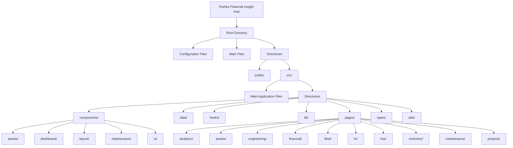

# EAMS  Insight Hub

Welcome to the EAMS  Insight Hub, a comprehensive system designed for financial management, asset tracking, maintenance, and analytics. This project provides a robust platform for managing various aspects of financial and operational data.

## Project Overview

The Toshka Financial Insight Hub is built with modern web technologies to ensure scalability, performance, and user-friendly interfaces. It includes modules for asset management, financial reporting, maintenance scheduling, inventory control, HR management, and more.

## Technology Stack

- **Frontend**: React.js with TypeScript, Vite for development, Tailwind CSS for styling
- **Configuration**: ESLint for linting, PostCSS for CSS processing
- **Package Management**: npm, Bun (as seen from bun.lockb)
- **UI Components**: Custom components and reusable UI elements from shadcn/ui

## Project Structure

Below is the detailed structure of the project directory, organized by functionality and purpose. A visual representation of the directory structure is provided in the diagram below:

### Root Directory
- **Configuration Files**:
  - `.gitignore`: Specifies intentionally untracked files to ignore
  - `eslint.config.js`: Configuration for ESLint to enforce code quality
  - `package.json`: Project metadata and dependencies
  - `postcss.config.js`: Configuration for PostCSS
  - `tailwind.config.ts`: Configuration for Tailwind CSS
  - `tsconfig.app.json`, `tsconfig.json`, `tsconfig.node.json`: TypeScript configuration files
  - `vite.config.ts`: Configuration for Vite, the build tool
- **Main Files**:
  - `index.html`: Entry point for the web application
  - `README.md`: Project documentation (this file)
- **Directories**:
  - `public/`: Static assets like favicon, placeholder images, and robots.txt
  - `src/`: Source code for the application

### Source Directory (`src/`)
- **Main Application Files**:
  - `App.tsx`, `App.css`: Main application component and styles
  - `main.tsx`: Entry point for React application
  - `index.css`: Global styles
  - `vite-env.d.ts`: TypeScript declarations for Vite environment
- **Directories**:
  - `components/`: Reusable UI components
    - `assets/`: Components related to asset management (e.g., `AssetFormModal.tsx`, `DepreciationChart.tsx`)
    - `dashboard/`: Dashboard components for data visualization (e.g., `AreaChart.tsx`, `StatCard.tsx`)
    - `layout/`: Structural components (e.g., `AppLayout.tsx`, `Navbar.tsx`, `Sidebar.tsx`)
    - `maintenance/`: Maintenance-related components (e.g., `WorkOrderFormModal.tsx`, `AIInsightsPanel.tsx`)
    - `ui/`: Shared UI components from shadcn/ui (e.g., `button.tsx`, `card.tsx`, `input.tsx`)
  - `data/`: Sample and mock data for development (e.g., `enhancedAssetData.ts`, `sampleAssets.ts`)
  - `hooks/`: Custom React hooks for state and logic reuse (e.g., `use-mobile.tsx`, `use-theme.tsx`)
  - `lib/`: Utility functions and shared code (e.g., `utils.ts`)
  - `pages/`: Page components for different routes and functionalities
    - `analytics/`: Pages for various reports (e.g., `AssetReports.tsx`, `FinancialReports.tsx`)
    - `assets/`: Asset management pages (e.g., `AssetTracking.tsx`, `EnhancedAssetRegistry.tsx`)
    - `engineering/`: Engineering department pages (e.g., `Civil.tsx`, `Mechanical.tsx`)
    - `financial/`: Financial management pages (e.g., `Budgeting.tsx`, `GeneralLedger.tsx`)
    - `fleet/`: Fleet management pages (e.g., `Vehicles.tsx`, `FuelManagement.tsx`)
    - `hr/`: Human Resources pages (e.g., `Employees.tsx`, `Payroll.tsx`)
    - `hse/`: Health, Safety, and Environment pages (e.g., `Incidents.tsx`, `Compliance.tsx`)
    - `inventory/`: Inventory management pages (e.g., `StockManagement.tsx`, `Procurement.tsx`)
    - `maintenance/`: Maintenance operation pages (e.g., `EnhancedWorkManagement.tsx`)
    - `projects/`: Project management pages
  - `types/`: TypeScript type definitions (e.g., `asset.ts`, `chat.ts`)
  - `utils/`: Utility functions for specific features (e.g., `chatUtils.ts`)

## Getting Started

To run the Toshka Financial Insight Hub locally:

1. **Clone the Repository**: If you haven't already, clone this repository to your local machine.
2. **Install Dependencies**: Run `npm install` to install the necessary packages.
3. **Start the Development Server**: Use `npm run dev` to start the Vite development server.
4. **Access the Application**: Open your browser and navigate to `http://localhost:5173` (or the port specified by Vite).

## Contributing

Contributions to the Toshka Financial Insight Hub are welcome. Please follow these steps to contribute:
- Fork the repository
- Create a new branch for your feature or bug fix
- Make your changes and commit them with descriptive messages
- Push your changes to your fork
- Submit a pull request to the main repository

## License

This project is licensed under the MIT License - see the LICENSE file for details.

## Contact

For any inquiries or support, please contact the project maintainers at support@toshkafinancial.com.

# Example for  System Comprehensive Evaluation Request
# Work Orders System Comprehensive Evaluation Request

## Objective
Conduct a thorough professional analysis and evaluation of our work orders page and all associated components, focusing on current implementation, identifying areas for improvement, and providing actionable recommendations for enhancement.

## Scope of Analysis

### 1. Core Functionality Assessment
- Work order CRUD operations
- Workflow management capabilities
- Data model and relationships
- Business rules implementation
- Integration points
- Search and filter mechanisms
- Automation features

### 2. User Interface (UI) Evaluation
- Layout and component organization
- Visual hierarchy and design consistency
- Responsive design implementation
- Interactive elements
- Form design and validation
- Navigation patterns
- Loading states and transitions

### 3. User Experience (UX) Analysis
- Task completion workflows
- Error handling and feedback
- Accessibility compliance
- Performance perception
- Intuitiveness of interactions
- Mobile/tablet experience
- User feedback integration

### 4. Technical Architecture Review
- Component structure
- State management
- Data flow patterns
- Code organization
- Reusability
- Maintainability
- Testing coverage

### 5. Performance Analysis
- Load times
- Resource utilization
- Caching strategies
- Data fetching patterns
- Optimization opportunities
- Scalability considerations

### 6. Data Management
- Data structure efficiency
- Validation rules
- Error handling
- Data integrity
- Backup and recovery
- Audit trails

### 7. Reporting and Analytics
- KPI tracking
- Dashboard effectiveness
- Report generation
- Data visualization
- Export capabilities
- Analytical tools

### 8. Security Assessment
- Authentication mechanisms
- Authorization rules
- Data protection
- Audit logging
- Compliance requirements

## Required Deliverables

### 1. Current State Analysis
- Detailed evaluation of existing implementation
- Strengths and weaknesses identification
- Pain points and bottlenecks
- User feedback summary

### 2. Gap Analysis
- Industry best practices comparison
- Missing features identification
- Technical debt assessment
- Compliance gaps

### 3. Recommendations
- Short-term improvements (0-3 months)
- Medium-term enhancements (3-6 months)
- Long-term strategic changes (6+ months)
- Priority matrix for implementation

### 4. Implementation Roadmap
- Phased approach outline
- Resource requirements
- Timeline estimates
- Dependencies identification
- Risk assessment

### 5. Success Metrics
- KPI definitions
- Measurement methodologies
- Baseline metrics
- Target improvements
- Monitoring plan

## Special Considerations

### 1. Industry Standards
- Compliance requirements
- Best practices alignment
- Security standards
- Accessibility guidelines

### 2. User Base
- Different user roles
- Skill levels
- Access patterns
- Special requirements

### 3. Integration Requirements
- Third-party systems
- APIs
- Data exchange patterns
- Real-time updates

### 4. Business Impact
- Operational efficiency
- Cost implications
- Resource utilization
- Time savings

## Expected Format

### 1. Executive Summary
- Key findings
- Critical recommendations
- Strategic impact

### 2. Detailed Analysis
- Section-wise breakdown
- Supporting data
- Technical details
- Visual aids

### 3. Recommendations
- Prioritized improvements
- Implementation approach
- Resource requirements
- Timeline projections

### 4. Supporting Materials
- Screenshots
- Flowcharts
- Code samples
- Metrics data

## Timeline Expectations
- Analysis completion: [Date]
- Draft review: [Date]
- Final submission: [Date]

## Additional Requirements
- Regular progress updates
- Stakeholder interviews
- User feedback incorporation
- Documentation review
- Technical feasibility assessment

Please provide a comprehensive evaluation addressing all the above aspects, with a focus on actionable insights and practical recommendations for improvement.
