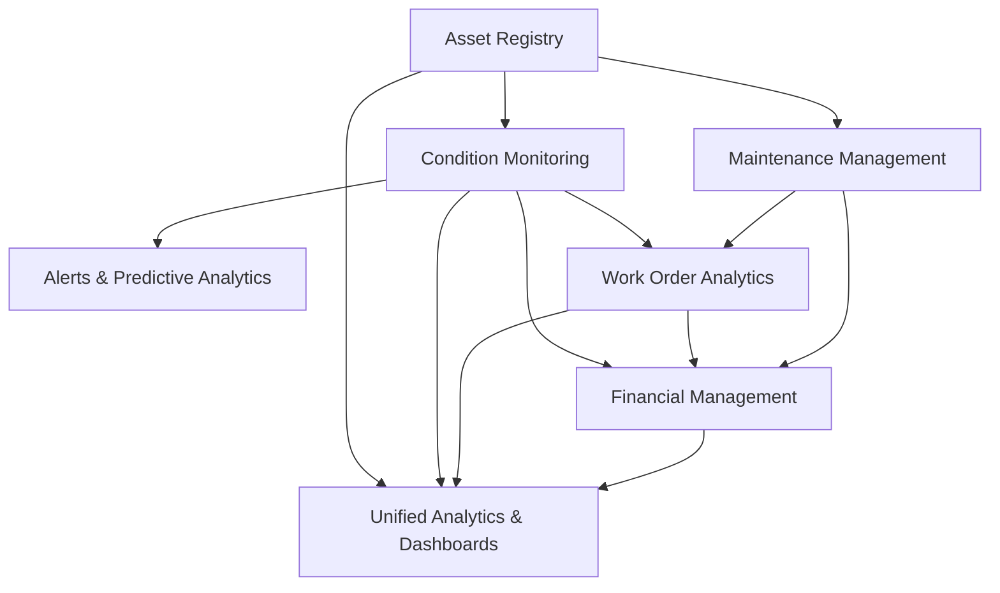
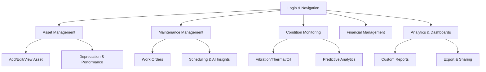

# Insight Hub (EAMS) – Advanced User Workflow Guide

---

## Introduction

Welcome to the Insight Hub (EAMS) Workflow Guide. This document provides a step-by-step, user-friendly walkthrough of all major workflows in the platform, designed for both new and advanced users. It covers Asset Management, Maintenance Management, Condition Monitoring, Financial Management, and Analytics, referencing the platform's advanced features, UI/UX, and best practices.

---

## Data Handling & Cross-Module Integration

Insight Hub (EAMS) is designed for seamless data flow and integration across all modules, similar to leading SAP, CMMS, and ERP systems. Every data entry, update, or action in one module is reflected in real time across analytics, dashboards, and related modules, ensuring unified business intelligence and operational efficiency.

### Data Flow & Integration Diagram

### How Data Flows Across the Platform

- **Asset Management:**
  - Adding or editing an asset updates the asset registry, which is immediately available for maintenance scheduling, condition monitoring, and financial calculations (depreciation, ROI).
  - Asset status, location, and specifications are referenced in work orders, condition logs, and analytics.

- **Condition Monitoring:**
  - New vibration, thermal, or oil readings are logged and linked to the relevant asset.
  - Alerts and health scores are generated and reflected in both the asset's details and the maintenance planning module.
  - Predictive analytics use historical and real-time data to trigger maintenance or financial impact analysis.

- **Maintenance Management:**
  - Creating or updating a work order references the asset registry and condition data.
  - Completion of work orders updates asset history, triggers cost calculations, and may reset or update condition monitoring KPIs.
  - Work order analytics feed into financial reports and unified dashboards.

- **Financial Management:**
  - Depreciation, budgeting, and cost analysis use real-time asset and maintenance data.
  - Maintenance costs, asset utilization, and condition-driven events (e.g., failures) are reflected in financial KPIs and reports.

- **Analytics & Dashboards:**
  - All modules feed data into unified dashboards, enabling cross-module insights (e.g., how asset health impacts maintenance cost and ROI).
  - Real-time updates ensure that any change in one module is instantly visible in analytics and reports.

### Example: Unified Data Flow

1. **A technician enters a new vibration reading for Pump A1.**
   - The reading is logged in Condition Monitoring and linked to Pump A1 in the Asset Registry.
   - If the reading exceeds thresholds, an alert is generated and shown in both the Condition Monitoring and Asset Management modules.
   - Predictive analytics may recommend a new maintenance work order, which is created in Maintenance Management and linked to Pump A1.
   - The work order, once completed, updates Pump A1's maintenance history and is reflected in financial cost analysis and depreciation schedules.
   - All these changes are immediately visible in the unified analytics dashboard, showing the impact on OEE, MTBF, cost, and risk.

### Best Practices for Data Consistency & Business Intelligence

- **Always use the platform's forms and workflows** for data entry to ensure all dependencies and analytics are updated.
- **Leverage real-time notifications and alerts** to stay informed of cross-module impacts.
- **Use unified dashboards** to monitor the health, cost, and performance of assets and operations.
- **Export and share reports** for compliance, audits, and decision-making.
- **Integrate with external systems (SAP, ERP, CMMS)** via API endpoints (future-ready architecture).

---

## Workflow Map

---

## 1. Getting Started: Login & Navigation

1. **Login:**
   - Access the platform via your organization's SSO or provided credentials.
   - Upon login, you'll land on the main dashboard with sidebar and top navigation.
2. **Navigation:**
   - Use the sidebar (desktop) or bottom nav (mobile) to access modules: Asset, Maintenance, Condition, Financial, Analytics, Inventory, HR, etc.
   - Quick actions and notifications are always accessible from the top bar.

---

## 2. Asset Management Workflow

### 2.1 Add/Edit/View Asset
1. **Go to Asset Management:**
   - Select "Asset Management" from the sidebar.
2. **Add Asset:**
   - Click "Add Asset" (floating button or toolbar).
   - Complete the multi-step form (`EnhancedAssetFormModal.tsx`): General Info, Specifications, Location, etc.
   - Validate required fields; use tooltips for help.
   - Save to add the asset to the registry.
3. **Edit/View Asset:**
   - Click on an asset row/card, then "Edit" or "View Details".
   - Use the details modal (`EnhancedAssetDetailsModal.tsx`) to review tabs: Overview, Monitoring, Maintenance, History, Documents.
   - Edit as needed and save changes.

### 2.2 Depreciation & Performance
1. **Depreciation:**
   - Navigate to "Asset Depreciation".
   - Filter assets, review depreciation charts and schedules (`AssetDepreciation.tsx`).
   - Export reports as needed.
2. **Performance:**
   - Go to "Asset Performance".
   - Analyze KPIs, trends, and ROI analytics (`AssetPerformance.tsx`).
   - Use filters and export options for deeper insights.

---

## 3. Maintenance Management Workflow

### 3.1 Work Orders
1. **Access Work Orders:**
   - Select "Maintenance Management" > "Work Orders".
2. **Create/Edit Work Order:**
   - Click "Add Work Order".
   - Fill in all required fields (title, equipment, priority, dates, cost, etc.).
   - Assign to technician(s) and set status.
   - Save to add to the work order list.
3. **Manage Work Orders:**
   - Use search, filters, and status/priority badges to find and update orders.
   - Start, complete, or edit orders as needed.
   - Use mobile view for field operations (`MobileWorkOrderCard`).

### 3.2 Scheduling & AI Insights
1. **Scheduling:**
   - Go to the "Scheduling" tab for an overview of upcoming and overdue work.
   - Review KPIs: completion rate, response time, efficiency, uptime.
2. **AI Insights:**
   - Open the "AI Insights" tab for predictive analytics and recommendations (`AIInsightsPanel`).
   - Review risk scores, suggested actions, and optimize schedules.

---

## 4. Condition Monitoring Workflow

### 4.1 Vibration, Thermal, Oil Analysis
1. **Access Condition Monitoring:**
   - Select "Condition Monitoring" from the sidebar.
2. **Vibration Tab:**
   - Switch between "Statistic Analysis" and "Vibration Reading Form".
   - Enter new readings; review trend charts and history log (`VibrationDataEntryForm`, floating widget).
3. **Thermal Tab:**
   - Review temperature analytics, hot spots, and delta T badges.
4. **Oil Analysis Tab:**
   - Review lubricant condition, metal content, and analysis history.
5. **Alerts Tab:**
   - View and acknowledge active alerts; filter by severity and type.

### 4.2 Predictive Analytics
1. **Predictive Tab:**
   - Access advanced analytics, Weibull analysis, ML-driven alerts, and health scores (`AdvancedPredictiveAnalytics`).
   - Review prescriptive recommendations and ML pipeline status.

---

## 5. Financial Management Workflow

1. **Access Financial Management:**
   - Select "Financial Management" from the sidebar.
2. **Review Reports:**
   - Open "Financial Reports" for area/bar/donut charts, ROI, depreciation, and budgeting.
   - Export or share reports as needed.

---

## 6. Analytics & Dashboards Workflow

1. **Access Analytics:**
   - Select "Analytics & Dashboards" from the sidebar.
2. **Review Dashboards:**
   - Use dashboard controls to select period, KPIs, and chart types.
   - Export or share dashboards and custom reports.

---

## 7. Best Practices & Tips

- **Use Filters:** Always use search and advanced filters to quickly find assets, work orders, or analytics.
- **Leverage AI/ML:** Use AI-powered insights for predictive maintenance and scheduling.
- **Export & Share:** Export charts, reports, and dashboards for compliance and collaboration.
- **Personalize:** Adjust theme, layout, and quick actions for your workflow.
- **Mobile Friendly:** Use mobile view for field operations and quick data entry.
- **Notifications:** Monitor alerts and notifications for real-time updates.
- **Help & Support:** Use tooltips, contextual help, and documentation links throughout the platform.

---

## 8. Workflow Quick Reference Table

| Module                | Key Workflow Steps                                                                 | Main UI Components/Pages                       |
|-----------------------|-----------------------------------------------------------------------------------|------------------------------------------------|
| Asset Management      | Add/Edit/View asset, depreciation, performance analytics                          | EnhancedAssetFormModal, EnhancedAssetDetailsModal, AssetDepreciation, AssetPerformance |
| Maintenance Management| Create/manage work orders, scheduling, AI insights, analytics, mobile operations  | WorkOrderFormModal, EnhancedWorkManagement, AIInsightsPanel, MobileWorkOrderCard      |
| Condition Monitoring  | Vibration/thermal/oil analysis, alerts, predictive analytics, history log         | ConditionMonitoring, VibrationDataEntryForm, AdvancedPredictiveAnalytics               |
| Financial Management  | Review/export financial reports, budgeting, ROI, depreciation                     | FinancialReports, AssetDepreciation                                                |
| Analytics & Dashboards| Review/export dashboards, custom reports, KPI analytics                           | AnalyticsDashboards, EnhancedChart, StatCard                                         |

---

## 9. Appendix: Diagrams & References

- See the main `PROJECT_FEATURES_REPORT.md` for full feature breakdowns, analytics, and component references.
- For technical integration, see the architecture and data flow diagrams in the main report.
- For testing, see `TEST_UNIFIED_DATA_FLOW.md` and `TESTING_GUIDE.md`.

---

*This workflow guide is designed for rapid onboarding and advanced usage. For further help, consult the in-app documentation or contact your system administrator.* 